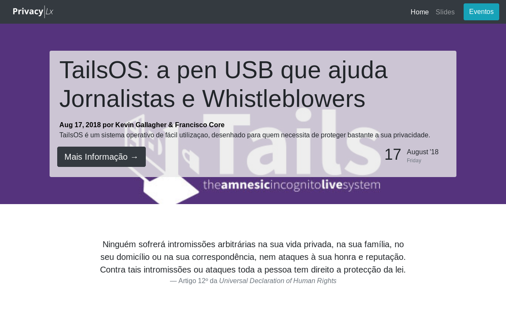

PrivacyLx website
=================

This is the website for the [PrivacyLx Privacy group](https://privacylx.org) based in Lisbon.



It is based on boostrap and uses hugo to generate the static website from the Markdown files

PrivacyLx website is also available under an onion service:
- v3 (http://p2jpwodl3q3kghx562tiuxert6azh4tpwz4hcu5jcypbckaqigcjf4qd.onion)
- v2 (http://ojr4ex25mf4tuxtm.onion)

Adding content
--------------

Since the website is based in Hugo, adding new posts / events is as simple as creating a markdown file in the right directory

Overview of the structure:
```tree
website
├── content -------> add content here
│   ├── events --------------> (add an event)
│   │   ├── event1.pt.md
│   │   └── event1.en.md
│   ├── post ----------------> (add a blog post)
│   │   ├── post1.pt.md
│   │   └── event1.en.md
│   └── resources -----------> (add slides or pdf)
│       ├── presentation1.pt.md
│       └── presentation1.en.md
├── static
│   ├── img ----------------> where images are stored
│   │   └── image1.png
│   └── slides--------------> where slides are stored
│       ├── slide1.pdf         (this is a git submodule)
│       └── sliderevealjs.html
└── themes -----------------> theme configuration
```

### Adding an Event

For that, in the website root directory you type `hugo new content/events/[name-of-event-separted-by-dashes].[en|pt].md` which will generate a template for you to fill.

just copy and paste some content's markdown from the type of
content that you want in order to add it.

### Adding images and presentations
All static content goes under `/static/` and is is referenced as though it was in the root of the website.

The presentations are a git submodule under `/static/slides`. They point to [https://github.com/PrivacyLx/slides](https://github.com/PrivacyLx/slides) and so, the should be added there instead. In addition to that, you should create a markdown file under `/content/resources/[name-of-the-presentation].md` in order to add it to the website's index of presentations over at [https://privacylx.org/resources/](https://privacylx.org/resources/).

**Note on revealjs presentations:** since they are html, js and css, we can show them directly on the index page. This can be done by adding in the markdown file `[name-of-the-presentation].md` the following

`` but without the html part.

Fox example: `` for the presentation stored in `/static/slides/cifra-te-ou-devoram-session00.html`

## Deployment
### Requirements
  * `unix-based system`
  * `caddy webserver`
  * `hugo` - generates the static

  For that, in the website root directory you type `hugo new content/events/[name-of-event-separted-by-dashes].[en|pt].md` which will generate a template for you to fill.website from `markdown` files

### Deploying
  * `cd /path/to/website`
  * configure webserver to host file generated by hugo
  * `./deploy-website.sh`


Editing Website Structure
-------------------------

This website uses [hugo](https://gohugo.io) to generate the [static website](https://en.wikipedia.org/wiki/Static_web_page).

### Development environment

1. clone this repo with `git clone https://github.com/PrivacyLx/website --depth=1`
2. Install [hugo](https://gohugo.io) or download the executable.
3. [cd](https://github.com/PrivacyLx/website) into the website directory
4. run local website server with `hugo -D server`
5. open browser with `http://localhost:1313`
6. edit website files

**Note:** the autorealoading feature will update the website as soon as you change
something but caching problems may occur and if something unexpected happens you
should restart the server (`hugo -D server`) and see if it persists

### Where to edit what 

It uses the [hugo-bootstrap](https://themes.gohugo.io/hugo-bootstrap/) to leverage
the aesthetics of [twitter bootstrap](https://getbootstrap.com/) and the simplicity
of hugo. All the files relating to the theme are under `themes/hugo-boostrap` and
that is where you should edit them. Here are the subfolders and their meaning:
  - `i18n` - where the translations strings like `{{ i18n "translated" }}` are.
  This is where you add / modify translations for the website structure (not the
  event's). Read more about i18n [here](https://gohugo.io/functions/i18n/).
  - `layout` - where the actual website structure is. Each entry is a section type.
    - `events` -  has all the special html parts of showing the `/events`
    part of the website
      - `baseof.html` - base structure of html page
      - `content` - main content of page (excludes header and footer)
      - `list` - when a list of items of this section are being preview (what reders "example.com/events", for example)
      - `single` - when a single article (event) is being viewed
      - `summary` - short preview of what article is
    - `partials` - reusable website parts. Read more [here](https://gohugo.io/templates/partials/)
    - `404.html` - self explanatory - this is the 404 page
    - `index.html` - the homepage

#### Creating additional sections
You can create aditional sections. Read more [here](https://gohugo.io/content-management/organization/). You may need to:
  - edit `config.toml` - the configuration file for the website to detect the new sections
  - create a new `archetype` - a template for when one wants to add a new article to that section

### More Documentation
For more you should read the official [hugo documentation](https://gohugo.io/documentation/)
